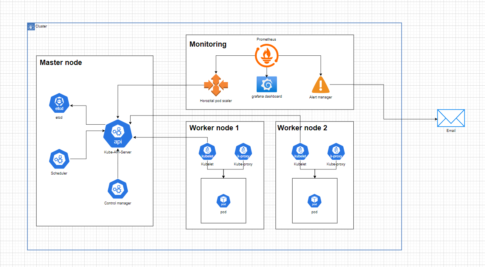

# Build an intelligent monitoring system for a Kubernetes cluster using Prometheus and Grafana

## 1. Tóm tắt
Đề tài tập trung vào xây dựng hệ thống giám sát thông minh cho cụm Kubernetes sử dụng Prometheus và Grafana. Nhóm triển khai một cụm gồm ba node (một master, hai worker) và cài đặt các công cụ như Prometheus, Grafana, Rancher để theo dõi hiệu năng hệ thống. Prometheus thu thập số liệu hiệu năng như CPU, RAM, trong khi Grafana hiển thị chúng dưới dạng dashboard trực quan. Hệ thống
cảnh báo được thiết lập để gửi email khi có sự cố về tài nguyên. Nhóm cũng triển khai các kịch bản thực nghiệm như stress test CPU, giám sát pods và tự động scale khi có nhiều request dẫn đến tăng CPU, Memory đột ngột. Ngoài ra, đề tài còn thử nghiệm tình huống khi một node bị tắt đột ngột để kiểm tra khả năng phản ứng của hệ thống.
## 2. Mô hình triển khai

### Ý tưởng thực hiện: ###
- Triển khai một cụm K8s gồm ba node, một node master và hai node worker.
- Trên node master sẽ cài đặt prometheus và grafana để quản lý, giám sát hiệu năng của cụm, ngoài ra cài đặt thêm Rancher để quản lý cụm K8s bằng ứng dụng web
- Triển khai một ứng dụng thông qua pod, nó sẽ được cấu hình triển khai thông qua file yaml trên master, khi đó pod sẽ được phân bổ trên tất cả các node worker.
- Cấu hình Alert management để gửi cảnh báo thông qua email khi hiệu năng cụm vượt ngưỡng như CPU, RAM,… Ngoài ra, khi ứng dụng được triển khai, nếu các traffic quá nhiều có thể dẫn tới nghẽn hay sập ứng dụng thì sẽ áp dụng scaling để cân bằng tải, khi đó cũng sẽ gửi email về để thông báo.
## 3. Triển khai
Nội dung triển khai, các bước thực hiện được nằm trong file PDF
## 4. Kết luận
Đề tài đã xây dựng và triển khai hệ thống giám sát hiệu năng cụm Kubernetes một
cách hiệu quả. Việc tích hợp Prometheus và Grafana cho phép nhóm theo dõi tài
nguyên theo thời gian thực và phát hiện sớm các bất thường trong hệ thống. Qua
các kịch bản thử nghiệm, hệ thống phản hồi tốt, gửi cảnh báo kịp thời và hỗ trợ
autoscaling hiệu quả. Đề tài không chỉ giúp nhóm học thêm nhiều kỹ năng kỹ
thuật mà còn củng cố kiến thức về kiến trúc hệ thống phân tán và công cụ giám22
sát. Tuy nhiên, vẫn còn tiềm năng cải thiện, như bổ sung cảnh báo nâng cao hoặc
tích hợp thêm công cụ AI để phân tích dự đoán. Kết quả đạt được là bước đầu
quan trọng hướng tới xây dựng các hệ thống giám sát tự động và thông minh
trong thực tế.
> Nội dung được thực hiện bởi nhóm 1 - Nhóm trưởng: Tô Công Quân

